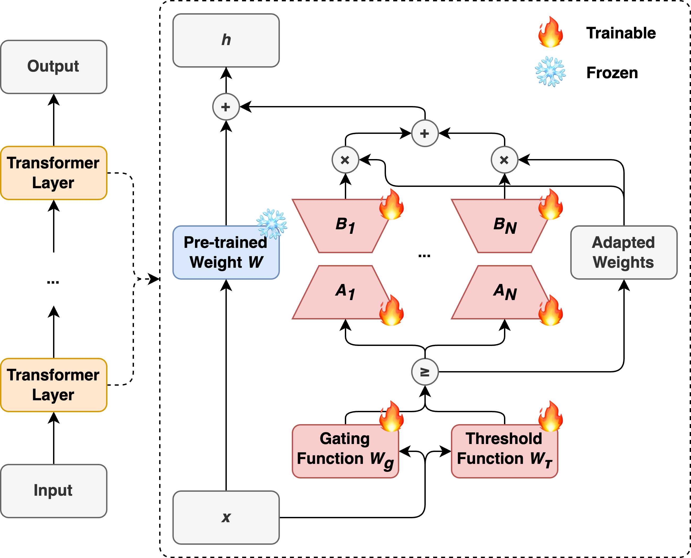

# \[COLM 2024\] AdaMoLE: Adaptive Mixture of Low-Rank Adaptation Experts

## Introduction

Explore AdaMoLE, a novel approach that integrates Low-Rank Adaptation (LoRA) with a dynamic Mixture of Experts (MoE) to enhance fine-tuning of Large Language Models (LLMs). AdaMoLE advances beyond static top-k expert activation by employing a dynamic thresholding mechanism, which adapts to the complexities of varied tasks to optimize model performance. This method efficiently selects and activates the most suitable experts based on input context, demonstrating superior performance in commonsense reasoning and natural language processing tasks.

For more details regarding AdaMoLE, you are welcome to refer to our [paper](https://arxiv.org/abs/2405.00361) and [poster](poster.pdf).

<div align="center">
  
</div>

## Features

- **Dynamic Expert Activation:** Improves expert activation with a dynamic threshold network, adapting to task complexities for optimal expert engagement.
- **Integration of LoRA and MoE:** Seamlessly combines Low-Rank Adaptation with the Mixture of Experts framework, enhancing the fine-tuning process for LLMs.
- **Hugging Face Compatibility:** Designed to be compatible with the Hugging Face's [Transformers](https://github.com/huggingface/transformers) and [Parameter-Efficient Fine-Tuning (PEFT)](https://github.com/huggingface/peft) library, ensuring ease of use and integration into existing workflows.

## Installation

```bash
# Navigate to the AdaMoLE directory
cd AdaMoLE

# Install required dependencies
pip install -r requirements.txt
```

## Usage

```bash
# Train the model
python train.py @configs/llama_adamole_csr_train.config

# Test the model
python test.py @configs/llama_adamole_csr_test.config
```

## Citation

If you find AdaMoLE useful in your projects, please consider citing our paper:

Liu, Z., & Luo, J. (2024). AdaMoLE: Fine-Tuning Large Language Models with Adaptive Mixture of Low-Rank Adaptation Experts. arXiv preprint *arXiv:2405.00361*.

```bibtex
@article{liu2024adamole,
  title={AdaMoLE: Fine-Tuning Large Language Models with Adaptive Mixture of Low-Rank Adaptation Experts},
  author={Liu, Zefang and Luo, Jiahua},
  journal={arXiv preprint arXiv:2405.00361},
  year={2024}
}
```

## License

This project is licensed under the MIT License. See the [LICENSE](LICENSE) file for details.
